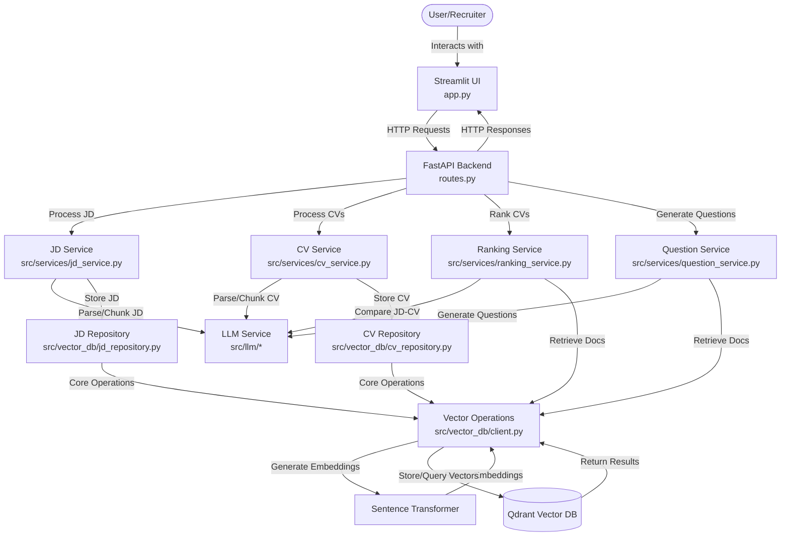
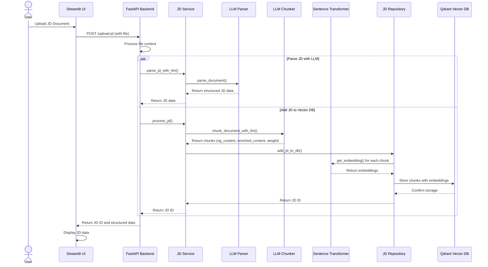
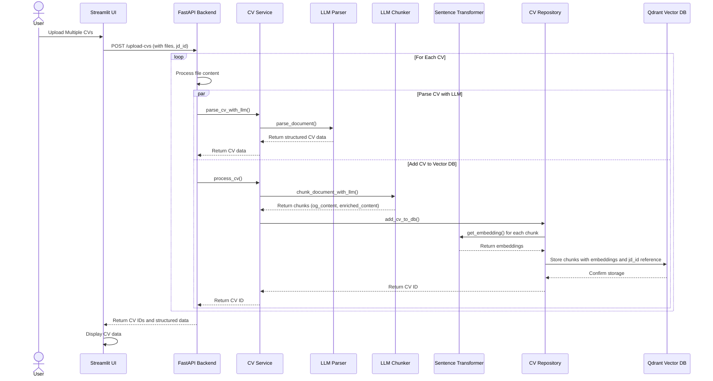
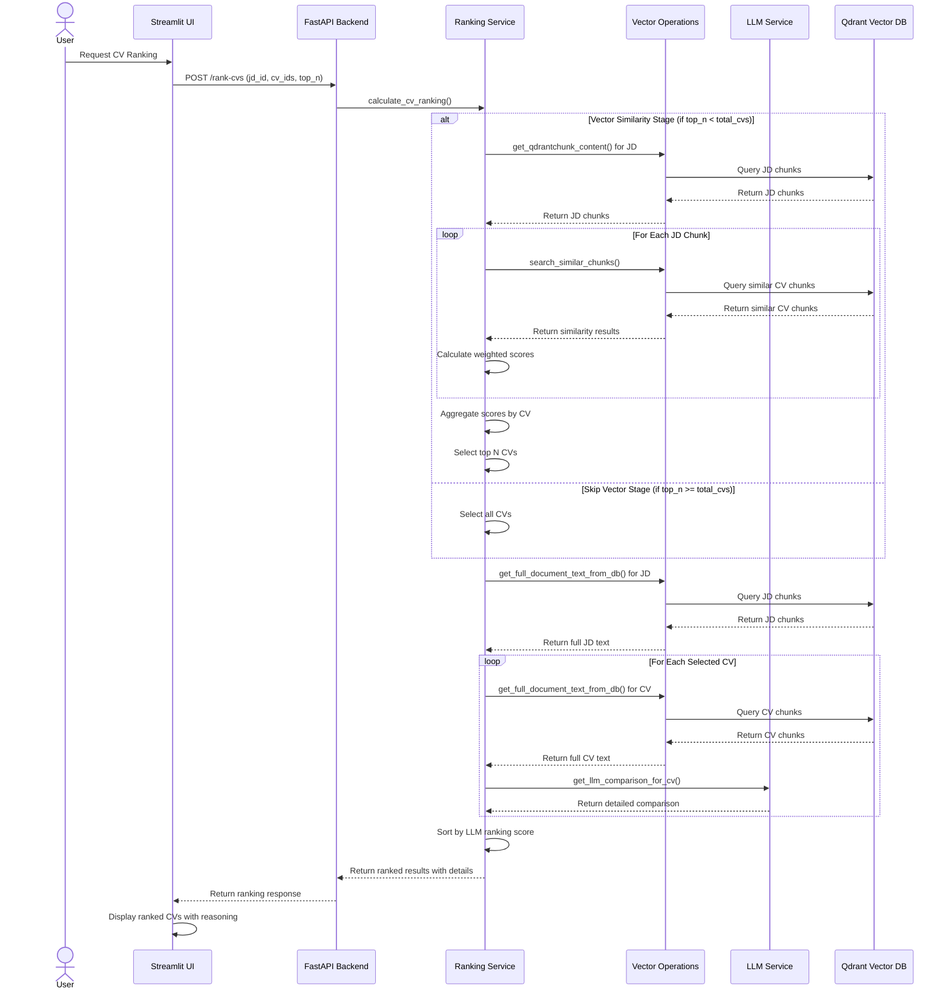
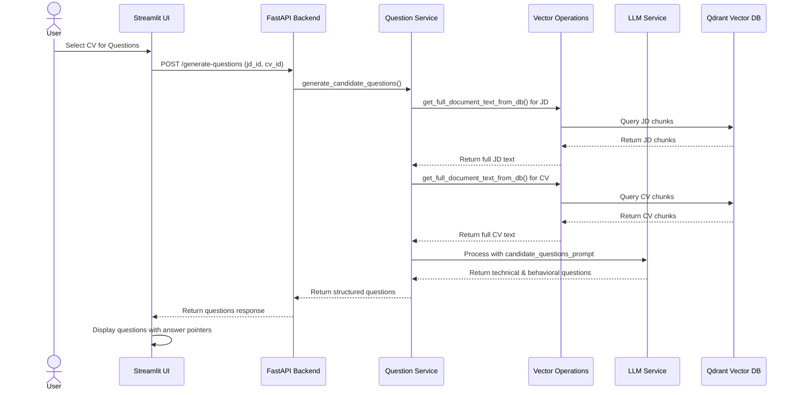
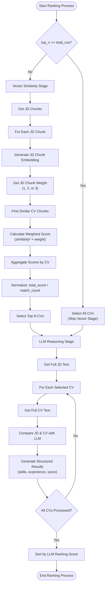
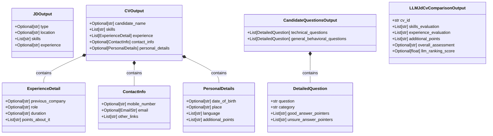
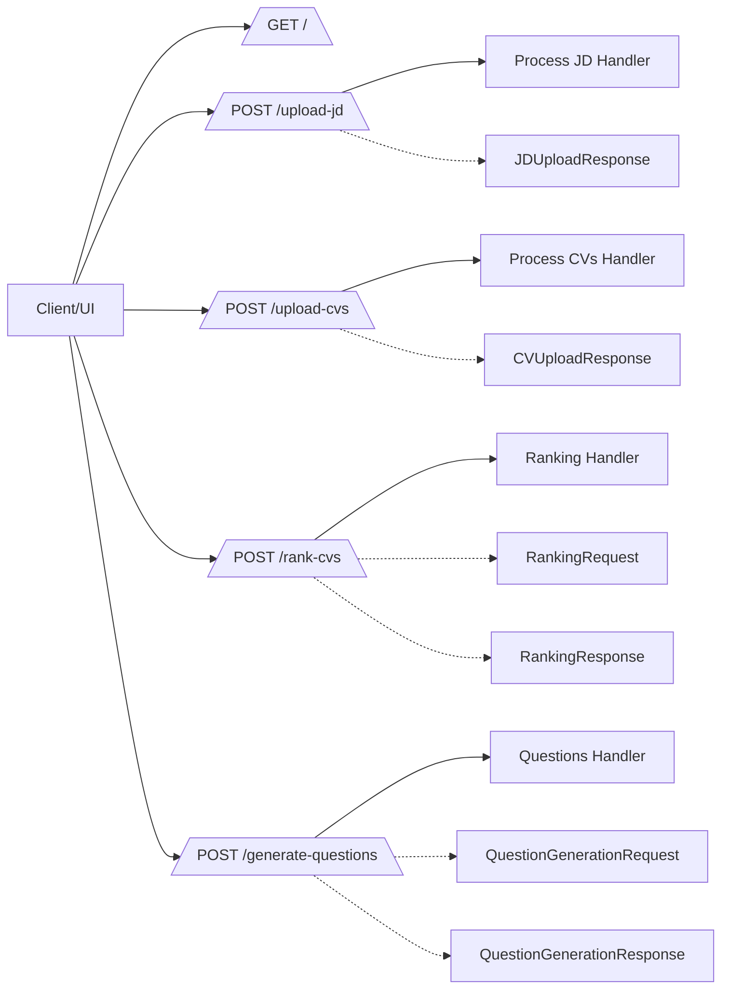
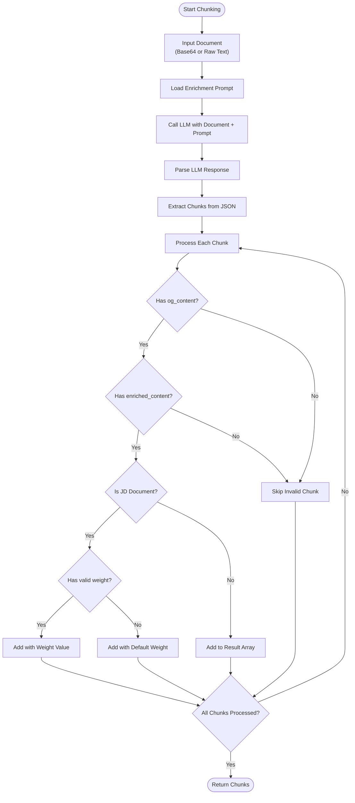

# Smart Recruit - Architecture Diagrams

This document contains architecture diagrams illustrating the structure, workflows, and interactions within the Smart Recruit system.

## 1. High-Level System Architecture



## 2. Document Processing Sequence

### 2.1 JD Processing Sequence



### 2.2 CV Processing Sequence



## 3. Ranking Workflow



## 4. Question Generation Workflow




## 5. Two-Stage Ranking Algorithm



### 5.1 Mathematical Foundation: Why We Square Similarity Scores

The core formula in our vector similarity stage is:
```
weighted_score_contribution = (similarity_score²) × jd_chunk_weight
```

**Why Squaring is Critical:**

1. **Non-Linear Penalty for Weak Matches**
   - Creates a steep penalty curve that dramatically reduces mediocre matches
   - Raw score 0.9 → 0.9² = 0.81 (only 10% reduction)
   - Raw score 0.6 → 0.6² = 0.36 (40% reduction)
   - Raw score 0.3 → 0.3² = 0.09 (70% reduction)

2. **Amplifies "Shiniest Moment" Effect**
   - Since we use `max_weighted_contribution` as the primary ranking metric
   - Rewards specialists with strong domain expertise over generalists with many weak matches
   - Ensures genuine expertise drives rankings, not just keyword frequency

3. **Quality Over Quantity Principle**
   - Prevents CVs from achieving high scores through many moderate matches
   - Only truly confident semantic alignments contribute meaningfully
   - Focuses on core competencies rather than surface-level similarities

4. **Statistical Noise Reduction**
   - Vector similarity scores contain noise from common words and semantic ambiguity
   - Squaring acts as a confidence threshold, filtering out weak correlations
   - Preserves only high-confidence matches for ranking decisions

**Example Impact:**
```
Job Requirement: "Senior Python Developer" (Weight = 3)

CV A (Generalist): Raw similarity = 0.6
- Without squaring: 0.6 × 3 = 1.8
- With squaring: 0.6² × 3 = 1.08

CV B (Python Expert): Raw similarity = 0.9  
- Without squaring: 0.9 × 3 = 2.7
- With squaring: 0.9² × 3 = 2.43

Gap widens from 1.5x to 2.25x, properly highlighting the specialist's advantage.
```

This mathematical approach ensures our ranking system identifies candidates with **strong, relevant expertise** rather than those who simply mention related terms without demonstrable depth.

## 6. Data Model



## 7. API Flow Diagram



## 8. Document Chunking Process

