# Smart Recruit - Architecture Diagrams

This document contains architecture diagrams illustrating the structure, workflows, and interactions within the Smart Recruit system.

## 1. High-Level System Architecture


## 2. Document Processing Sequence

### 2.1 JD Processing Sequence (S3-Based)


### 2.2 CV Processing Sequence (S3-Based with Retry Logic)

```mermaid
sequenceDiagram
    actor User
    participant UI as Streamlit UI
    participant API as FastAPI Backend
    participant S3H as S3 Handler
    participant S3 as AWS S3
    participant CVS as CV Service
    participant LLM_P as LLM Parser
    participant LLM_C as LLM Chunker
    participant ST as Sentence Transformer
    participant CVR as CV Repository
    participant VDB as Qdrant Vector DB
    
    User->>UI: Provide S3 URI for CV
    UI->>API: POST /s3-upload-cv (S3 URI)
    API->>S3H: get_file_from_s3(s3_uri)
    S3H->>S3: Download file from S3
    S3-->>S3H: Return file content + metadata
    S3H-->>API: Return {base64_content, raw_text, metadata}
    
    loop Retry Logic (Max 2 Attempts)
        API->>API: Generate unique CV ID
        
        par Parse CV with LLM
            API->>CVS: parse_cv_with_llm()
            CVS->>LLM_P: parse_document()
            alt LLM Parsing Success
                LLM_P-->>CVS: Return structured CV data
                CVS-->>API: Return CV data
            else LLM Parsing Failure
                LLM_P-->>CVS: Return error
                CVS-->>API: Return error with raw response
            end
        and Add CV to Vector DB with Rich Metadata
            API->>CVR: add_cv_to_db()
            CVR->>LLM_C: chunk_document_with_llm()
            alt Chunking Success
                LLM_C-->>CVR: Return chunks (og_content, enriched_content)
                CVR->>ST: get_embedding() for each enriched chunk
                ST-->>CVR: Return embeddings
                CVR->>VDB: Store chunks with embeddings + S3 metadata
                Note over VDB: Metadata includes: S3 URI, bucket, key,<br/>file size, content type, original_doc_id
                VDB-->>CVR: Confirm storage
                CVR-->>API: Return CV ID (Success)
            else Chunking/Storage Failure
                CVR-->>API: Return error
            end
        end
        
        alt Both Operations Successful
            break Success - Exit Retry Loop
        else Any Operation Failed and Attempts Remaining
            API->>API: Wait 3 seconds before retry
        else All Attempts Exhausted
            API->>API: Return final error status
        end
    end
    
    API-->>UI: Return CV processing result with detailed status
    UI->>UI: Display CV data with processing status and error details
```

## 3. Advanced Ranking Workflow with Optimization


## 4. Question Generation Workflow


## 5. Advanced Two-Stage Ranking Algorithm with Business Intelligence

```mermaid
graph TD
    Start([Start Ranking Process]) --> CheckOptimization{top_n >= total_cvs?}
    
    %% Optimization Path
    CheckOptimization -->|Yes| LogOptimization["🚀 Log Optimization Decision<br/>Skip Vector Stage for Efficiency"]
    LogOptimization --> SelectAll["Select All CVs<br/>(Neutral Vector Scores)"]
    
    %% Vector Similarity Stage
    CheckOptimization -->|No| VectorStage["📊 Vector Similarity Stage"]
    VectorStage --> GetWeightedJDChunks["Get JD Chunks with Weights<br/>(1=General, 2=Desirable, 3=Essential)"]
    GetWeightedJDChunks --> ChunkLoop["For Each Weighted JD Chunk"]
    ChunkLoop --> GetEmbedding["Generate JD Chunk Embedding<br/>(Enriched Content)"]
    GetEmbedding --> FindSimilar["Find Top 15 Similar CV Chunks<br/>(Filtered by Active CV IDs)"]
    FindSimilar --> CalcAdvancedScore["🧮 Calculate Advanced Weighted Score<br/>(similarity² × jd_chunk_weight)"]
    
    CalcAdvancedScore --> ExplainFormula["📝 Mathematical Rationale:<br/>• Squaring penalizes weak matches<br/>• Amplifies strong domain expertise<br/>• Reduces noise from common terms"]
    ExplainFormula --> AggregateByCV["Aggregate Scores by CV<br/>Track: total_score, max_contribution, match_count"]
    AggregateByCV --> UseMaxContribution["🎯 Primary Ranking: max_weighted_contribution<br/>(Rewards 'Shiniest Moment' over quantity)"]
    UseMaxContribution --> DetailedLogging["📋 Log Detailed Match Analysis<br/>Per CV: filename, scores, explanations"]
    DetailedLogging --> SelectTopN["Select Top N CVs for LLM Stage"]
    
    %% LLM Reasoning Stage
    SelectAll --> LLMStage["🤖 LLM Reasoning Stage"]
    SelectTopN --> LLMStage
    LLMStage --> GetFullTexts["Retrieve Full Document Texts<br/>(Reconstructed from Chunks)"]
    GetFullTexts --> ParallelLLM["⚡ Parallel LLM Processing<br/>(Async for Performance)"]
    ParallelLLM --> StructuredComparison["Generate Structured Comparisons:<br/>• Skills Evaluation<br/>• Experience Assessment<br/>• Additional Points<br/>• Overall Assessment<br/>• Numerical Score (1-10)"]
    StructuredComparison --> ErrorHandling["🛡️ Robust Error Handling<br/>Graceful degradation for LLM failures"]
    ErrorHandling --> FinalSort["Sort by LLM Ranking Score<br/>(Hide Vector Scores from Users)"]
    FinalSort --> End([End Ranking Process])
   
```



### 5.1 Enhanced Mathematical Foundation

The core formula in our vector similarity stage is:
```
weighted_score_contribution = (similarity_score²) × jd_chunk_weight
primary_ranking_metric = max_weighted_contribution_per_cv
```

**Advanced Business Logic Features:**

1. **Intelligent Optimization**
   - Automatically detects when `top_n >= total_cvs`
   - Skips computationally expensive vector similarity stage
   - Logs optimization decisions for transparency
   - Improves performance by 3-5x for small batches

2. **Sophisticated Weighting System**
   - JD chunks assigned weights: 1 (General), 2 (Desirable), 3 (Essential)
   - LLM determines importance during chunking phase
   - Ensures critical requirements have higher impact on rankings

3. **"Shiniest Moment" Ranking Philosophy**
   - Uses `max_weighted_contribution` instead of average scores
   - Rewards candidates with exceptional strength in key areas
   - Prevents dilution from many mediocre matches
   - Identifies specialists over generalists

4. **Advanced Error Recovery**
   - Retry mechanism with exponential backoff (3-second delays)
   - Graceful degradation for partial failures
   - Detailed error logging with context preservation
   - Separate success tracking for DB and LLM operations

5. **Rich Metadata Integration**
   - S3 source tracking (bucket, key, URI)
   - File size and content type preservation
   - Processing timestamps and attempt counts
   - Enhanced searchability and debugging capabilities

## 6. S3 Integration Architecture


## 7. Enhanced Data Model with Metadata


## 8. Advanced API Flow with S3 Integration


## 9. Business Intelligence Features

### 9.1 Advanced Retry Logic
- **Exponential Backoff**: 3-second delays between attempts
- **Granular Error Tracking**: Separate success flags for DB and LLM operations
- **Context Preservation**: Maintains error history across retry attempts
- **Intelligent Recovery**: Different strategies for different failure types

### 9.2 Metadata-Driven Operations
- **Source Tracking**: Complete S3 provenance (bucket, key, URI)
- **Processing History**: Timestamps, attempt counts, status tracking
- **Performance Metrics**: File sizes, processing times, success rates
- **Debugging Support**: Rich context for troubleshooting failures

### 9.3 Optimization Intelligence
- **Automatic Performance Tuning**: Detects and applies optimizations
- **Resource Management**: Efficient allocation based on workload
- **Scalability Awareness**: Adapts behavior based on data volume
- **Transparency**: Comprehensive logging of optimization decisions

### 9.4 Quality Assurance
- **Multi-Stage Validation**: Input validation, processing verification, output validation
- **Error Categorization**: Different handling for different error types
- **Graceful Degradation**: Partial success handling with clear status reporting
- **User Experience**: Clear feedback on processing status and any issues 